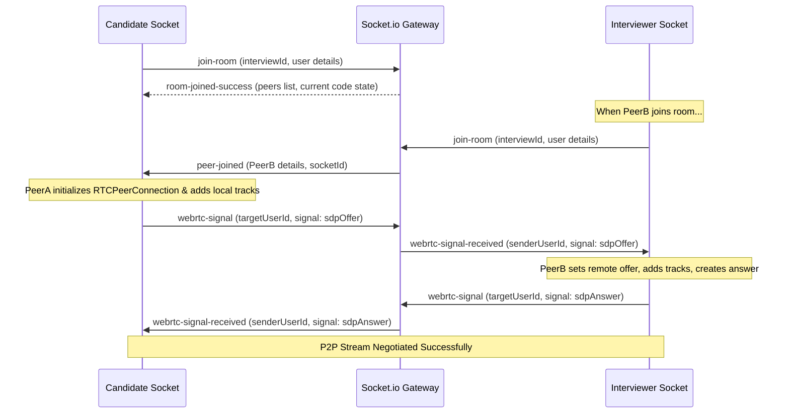

# InterviewOS

InterviewOS is a production-grade, AI-powered realtime collaboration and interview platform that integrates Zoom-style peer-to-peer video calls, Loom-style screen recording, HackerRank-style synchronized coding, and automatic speech-to-text Whisper transcripts.

The frontend is styled in a **dark-mode-first Apple catalog design system** with Action Blue accents, strict typography letter-spacing rules, and low elevation guidelines.

---

## 🏗️ Architecture & Monorepo Structure

InterviewOS is set up as a modular monorepo using **npm workspaces**:

```
InterviewOS/
├── apps/
│   ├── frontend/         # Next.js (App Router, Tailwind v4, Zustand, Framer Motion)
│   └── backend/          # NestJS (Socket.io Gateway, Prisma, PostgreSQL, Passport JWT)
├── docker-compose.yml    # PostgreSQL database service
├── package.json          # Root workspace scripts and dependencies
├── .env.example          # Environment variable template
└── README.md             # This document
```

### Key Architectural Layers:
1. **API Layer**: Standard REST endpoints hosted by NestJS (`/api/auth/*` and `/api/interviews/*`) secured with Bearer JWT tokens.
2. **Realtime Signaling Layer**: WebSocket connection gateway using Socket.io inside NestJS to relay WebRTC session offers, answers, ICE candidates, collaborative keystrokes, speaking waveforms, and transcription segments.
3. **Database Layer**: SQLite managed via Prisma ORM for simplified local zero-config data relationships.
4. **Media & AI services**: Modular structures inside the backend prepared to pipe recorded WebM buffers and stream audio chunks to Whisper transcripts.
5. **State Layer (UI)**: Zustand global state stores tracking connections, peers, stream objects, and code synchronization.

---

## ⚡ WebRTC & Realtime Synchronization Flows

The platform coordinates peer-to-peer connection handshakes dynamically:



* **Keystroke Sync**: Broadcasts client `code-change` events over WebSockets to other room participants. Keeps the code state synchronized in the PostgreSQL database.
* **Waveform Audio**: Checks local mic levels and relays numerical peaks (`audio-level`) to feed interactive speaker waveforms in the UI.

---

## 🎨 UI/UX Design System (Tailwind v4)

Our styles are mapped in `apps/frontend/src/app/globals.css` according to `DESIGN.md`:

* **Accent color**: Action Blue (`#0066cc` / `--color-primary`) is the single BRAND interactive indicator. Focus rings use Focus Blue (`#0071e3`).
* **Canvases**: Alt dark tiles (`#272729` / `--color-surface-tile-1`, `#2a2a2c`, `#252527`) rest on pure black backdrop (`#000000`).
* **Rounded corner constants**: SM (`8px` for buttons), MD (`11px` capsules), LG (`18px` cards), and full Pill (`9999px`).
* **Product drop shadow**: `rgba(0, 0, 0, 0.22) 3px 5px 30px` is applied ONLY to video feed panels representing webcam sources, matching Apple's surface images hierarchy.

---

## 🚀 Development Quickstart

### 1. Prerequisites
Ensure you have Node.js (v18+) installed.

### 2. Environment Setup
Copy the example variables:
```bash
cp .env.example .env
```

### 3. Install Dependencies
Run the command in the root folder to download npm workspace packages:
```bash
npm install
```

### 4. Run SQLite Migrations & Generate Client
Prisma uses SQLite for local zero-configuration development:
```bash
# In apps/backend workspace directory:
npx prisma migrate dev --name init
```

### 5. Run Dev Servers Concurrently
Boot the Next.js frontend (port `3000`) and NestJS backend (port `3001`):
```bash
# From root workspace directory:
npm run dev
```

---

## 🗺️ Engineering Development Roadmap

### Phase 1: Authentication & Signaling Foundation (Complete)
* [x] Scaffold monorepo workspaces and Docker configs.
* [x] Implement JWT registration & login backend schemas.
* [x] Configure Socket.io Gateway signaling WebRTC offers & answers.
* [x] Set up Zustand stores synchronizing local and remote media stream elements.

### Phase 2: Live Room Features (In Progress)
* [x] Create Apple-themed collaborative coding editor with compiler inputs.
* [x] Implement audio visualizer nodes mapping live vocal waveforms.
* [x] Set up MediaRecorder screen recording hooks.

### Phase 3: Whisper Pipeline & AI Review (Future)
* [ ] Integrate Whisper speech-to-text API chunks queue in `AiService`.
* [ ] Connect OpenAI completion prompts evaluating candidate answers.
* [ ] Save final recordings on AWS S3 buckets or local storage folders.

### Phase 4: Production Deployment & Scaling
* [ ] Setup WebRTC TURN servers for NAT traversal.
* [ ] Build Kubernetes / Docker production configurations.
* [ ] Deploy apps to AWS EC2 or Vercel serverless functions.
